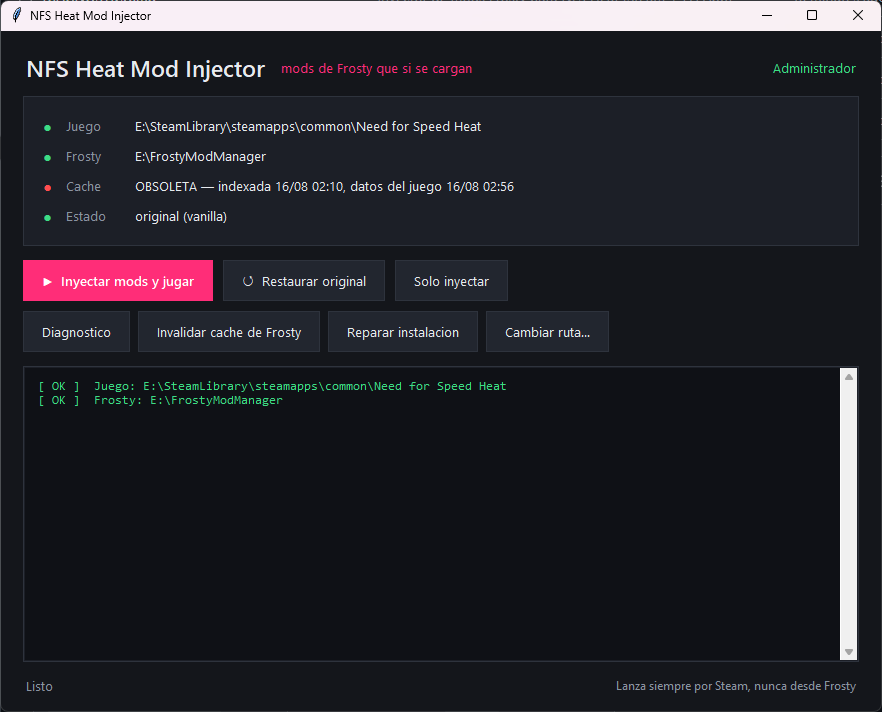

# NFS Heat Mod Injector

**Español** · [**English → README.en.md**](README.en.md)

Haz que los mods de Frosty **se carguen de verdad** en Need for Speed Heat, en Steam + EA App.

Frosty compila tus mods en `ModData\Default`, pero en muchas instalaciones de Steam
**su botón Launch arranca el juego sin aplicarlos**. El juego abre bien, así que parece
que funcionó — y te pasas la tarde preguntándote por qué tu mod no hace nada. Esta
herramienta cierra ese hueco: mete el payload compilado por Frosty en los archivos que
el juego realmente lee, con respaldos verificados y vuelta atrás en un comando.

> Modding de un juego de un jugador, en tu propia instalación. Aquí no se toca
> anti-cheat, DRM ni juego en línea.

---

## Antes de empezar

**Esta herramienta no sustituye a Frosty: lo complementa.** Frosty es quien compila tus
mods; esto es lo que hace que el juego los cargue.

```
Tus .fbmod  →  Frosty Mod Manager  →  ModData\Default  →  Esta herramienta  →  El juego
                    (compila)                                  (inyecta)
```

Necesitas las cuatro cosas:

| Requisito | Notas |
|---|---|
| **Need for Speed Heat** | Steam o EA App. Instalado y arrancado al menos una vez |
| **Frosty Mod Manager** | Es quien genera `ModData`. Sin él esta herramienta no tiene nada que inyectar |
| **Tus mods `.fbmod`** | Se ponen en `<Frosty>\Mods\NeedForSpeedHeat\` |
| **Windows 10 u 11** | Con permisos de administrador |

### De dónde bajar Frosty

Solo desde la fuente oficial:

- **Sitio oficial:** <https://frostytoolsuite.com>
- **Repositorio oficial:** <https://github.com/CadeEvs/FrostyToolsuite> (autor: CadeEvs)

> ⚠️ **Cuidado con las webs falsas.** Buscar "frosty mod manager download" devuelve sobre
> todo mirrors y dominios que imitan el nombre (`frostymodmanager.net`, agregadores de
> descargas, etc.). Vas a instalar un programa que modifica tus juegos: bájalo solo de
> los dos enlaces de arriba.

Verificado funcionando con **Frosty Mod Manager 1.0.6.3**. Frosty necesita además el
perfil de NFS Heat (`NFSHEATSDK.dll`), que viene con el propio programa.

### Primera vez con Frosty

1. Ábrelo y señálale la carpeta de Need for Speed Heat cuando la pida.
2. Deja que construya su índice de assets. Tarda varios minutos la primera vez.
3. Arrastra tus `.fbmod` al panel de mods disponibles y pásalos a la lista de aplicados.
4. Pulsa **Launch** para que compile `ModData`.

A partir de ahí ya entra esta herramienta. El paso 4 arranca el juego pero **no aplica
los mods** — es la trampa que explica la sección
[Cómo usarlo, paso a paso](#cómo-usarlo-paso-a-paso).

---

## Por qué no vale con copiar los archivos a mano

Porque `ModData\Default` **no es una carpeta de archivos**. Es un espejo hecho de
enlaces simbólicos:

| Entrada | Qué es realmente |
|---|---|
| `ModData\Default\Data` | **Enlace simbólico** → `<juego>\Data` |
| `ModData\Default\Update` | Enlace simbólico **roto** (no existe `Update`) |
| `ModData\Default\patch\win32\*` | 74 de 76 entradas son **enlaces** a contenido vanilla |
| El payload real del mod | **6 archivos**, ~24 MB |

Copia ese árbol con `xcopy`, `robocopy`, `shutil.copytree` o bórralo con
`Remove-Item -Recurse` y seguirás el enlace `Data` hasta la carpeta real de tu juego.
Una herramienta anterior hizo exactamente eso en la instalación para la que se construyó
esto: se llevó cinco archivos vanilla de `Data\Win32`, chocó con un archivo bloqueado y
murió sin rollback, dejando una instalación rota que *parecía* un problema de permisos.

**Esta herramienta nunca desciende en un reparse point.** Ese es todo el asunto.

---

## Descarga (sin necesidad de Python)

Baja **`NFSHeatModInjector.exe`** de la
[última release](https://github.com/zetxxs/nfs-heat-mod-injector/releases/latest) y haz
doble clic. Encuentra tu juego, tu Frosty y tu caché por sí solo.



### Windows te va a avisar, y con razón

El ejecutable **no está firmado** (un certificado cuesta cientos de euros al año), así
que:

- **SmartScreen** dirá *"Windows protegió su PC"* → **Más información** → **Ejecutar de
  todas formas**.
- **Defender puede marcarlo.** Y no es un falso positivo tonto: la herramienta mata
  procesos (`EADesktop`, `Steam`), toma propiedad de archivos con `takeown` e `icacls`, y
  reescribe datos del juego. Ese es exactamente el perfil de comportamiento que un
  antivirus está hecho para cazar. La diferencia es que actúa sobre tu juego, en tu
  máquina, porque tú se lo pides.
- Pide **administrador** al arrancar. Lo necesita para soltar los bloqueos de archivo que
  mantiene EA App.

Si prefieres no fiarte del binario de un desconocido — postura razonable —,
**ejecútalo desde el código**. Es Python plano, sin dependencias, y puedes leer cada
línea:

```bash
python nfs_heat_gui.py       # la misma interfaz
python nfs_heat_injector.py  # versión de consola
```

Verifica la descarga si quieres. El hash esperado está en las notas de la release:

```powershell
Get-FileHash NFSHeatModInjector.exe -Algorithm SHA256
```

---

## Cómo usarlo, paso a paso

Al abrirse rellena el panel de arriba solo. No escribes ninguna ruta.

### Qué te dice el panel de estado

| Fila | Qué significa |
|---|---|
| **Juego** | Dónde está tu juego. Verde = encontrado. Rojo = pulsa **Cambiar ruta…** y señala la carpeta |
| **Frosty** | Dónde está Frosty Mod Manager. Ámbar si no lo encuentra; solo afecta al aviso de caché |
| **Cache** | Si el índice de Frosty sigue coincidiendo con tu juego |
| **Estado** | `original (vanilla)` = juego limpio. `MODS INYECTADOS` = los mods están puestos |

### Qué hace cada botón

| Botón | Qué pasa |
|---|---|
| **▶ Inyectar mods y jugar** | Copia los archivos compilados por Frosty al juego y lo lanza por Steam. El que más vas a usar |
| **↺ Restaurar original** | Devuelve los archivos originales desde los respaldos verificados. Hazlo antes de recompilar en Frosty y antes de jugar en línea |
| **Solo inyectar** | Lo mismo que el primero pero sin lanzar |
| **Diagnostico** | Enseña todo lo que sabe: rutas, caché, payload, integridad. Solo lee, seguro en cualquier momento |
| **Invalidar cache de Frosty** | Renombra el índice de Frosty para que lo reconstruya. Solo hace falta si el juego cambió de verdad |
| **Reparar instalacion** | Devuelve archivos vanilla que una herramienta rota se llevó y nunca repuso |
| **Cambiar ruta…** | Señalar la carpeta del juego a mano |

### El orden que funciona

```
1. Restaurar original            ← deja una base limpia y respaldos honestos
2. Frosty → aplicar mods → Launch  ← SOLO para compilar. Cierra el juego cuando abra.
3. Inyectar mods y jugar
```

**El paso 2 es donde tropieza todo el mundo.** El botón Launch de Frosty compila
`ModData` **y** arranca el juego — pero ese arranque **no aplica tus mods**. Como el
juego abre sin errores, parece que funcionó. Déjalo abrir, ciérralo, y vuelve aquí a
inyectar.

Y una vez inyectado, **lanza desde Steam o desde esta herramienta, nunca más desde
Frosty.** Frosty reinstala su ejecutable proxy al lanzar y puede deshacer la inyección.

### Antes de probar mods de recompensa

Los mods de dinero y REP escriben en tu partida, y un desbordamiento puede dejarte el
saldo en negativo. Ese daño está en el archivo de guardado, no en los del juego, así que
restaurar **no** lo deshace. Copia esto antes:

```
Documentos\Need for Speed Heat\SaveGame\savegame\1
```

El juego guarda un solo archivo y lo sobrescribe al salir.

---

## Desde la consola

```bash
git clone https://github.com/zetxxs/nfs-heat-mod-injector.git
cd nfs-heat-mod-injector
python nfs_heat_injector.py --diagnostico
```

**Sin configurar nada.** Encuentra la instalación por sí solo:

| Qué | Cómo lo encuentra |
|---|---|
| El juego | Registro de desinstalación de Windows (cubre Steam **y** EA App) → `libraryfolders.vdf` + `appmanifest_1222680.acf` → escaneo de unidades |
| Frosty Mod Manager | `FrostyModManager.exe` en la unidad del juego, luego el resto y Archivos de programa |
| La caché de Frosty | `<Frosty>\Caches\NFSHEAT.cache` |

Puedes forzar cualquiera con `--juego "X:\...\Need for Speed Heat"` o
`--frosty "X:\FrostyModManager"`.

### Menú interactivo

```bash
python nfs_heat_injector.py
```

```
[1] Inyectar Mods y Lanzar Juego (Steam Protocol)
[2] Restaurar Archivos Originales (Vanilla)
[3] Salir
--- Herramientas ---
[4] Diagnóstico   [5] Reparar instalación   [6] Exclusión de Defender
[7] Solo liberar  [8] Inyectar sin lanzar   [9] Invalidar caché de Frosty
```

### Opciones

| Opción | Qué hace |
|---|---|
| `--diagnostico` | Informe de estado. Solo lectura, seguro en cualquier momento |
| `--inyectar` | Inyecta el payload y sale |
| `--lanzar` | Inyecta si hace falta y lanza por Steam |
| `--restaurar` | Vuelve a vanilla usando el manifiesto |
| `--reparar` | Restaura archivos vanilla que una herramienta rota dejó huérfanos |
| `--invalidar-cache` | Renombra la caché de Frosty y ofrece borrar `ModData` |
| `--juego <ruta>` | Carpeta del juego (autodetectada si se omite) |
| `--frosty <ruta>` | Carpeta de Frosty (autodetectada si se omite) |
| `--modo` | `copia` (defecto) · `hardlink` · `junction` |
| `--si` | Responde SÍ a todo (ejecución desatendida) |
| `--forzar` | Reinyecta pese al manifiesto |
| `--sin-elevar` | No pide UAC (depuración) |

Sin `--si`, una confirmación con `stdin` cerrado se interpreta como **NO**, nunca como sí
implícito.

---

## Garantías de diseño

- **Nunca desciende en un reparse point** (`FILE_ATTRIBUTE_REPARSE_POINT` vía
  `GetFileAttributesW`). La salvaguarda que evita el desastre de arriba.
- **Detección de identidad física** (`GetFileInformationByHandle` → volumen + índice MFT):
  si origen y destino son el mismo inodo, lo omite en vez de destruirlo. Así distingue
  los enlaces de Frosty de los archivos reales del mod.
- **Respaldo por copia verificada con hash, jamás por movimiento.** Si la copia falla, tu
  juego queda intacto. Un movimiento que falla a medias es lo que rompe instalaciones.
- **Transaccional con rollback**: un fallo a mitad de inyección revierte en orden inverso
  lo ya aplicado.
- **Manifiesto atómico** (`os.replace`): impide que una segunda inyección pise los
  respaldos vanilla buenos con archivos ya modificados.
- **Independiente del idioma**: procesos vía `CreateToolhelp32Snapshot` (nunca parsea
  `tasklist`), permisos con el SID `*S-1-1-0` (no la cadena traducida "Todos"/"Everyone"),
  servicios juzgados por código de salida.
- **Detección real de bloqueo**: `CreateFileW` con `dwShareMode = 0`, espera con backoff
  exponencial, y nombra al proceso culpable si `psutil` está instalado.

El modo por defecto es **`copia`**, no `hardlink`: un enlace duro comparte inodo con
`ModData`, así que si Frosty recompila más tarde el juego puede quedarse con contenido
obsoleto en silencio.

---

## Si algo va mal

### El juego crashea después de inyectar

NFS Heat **no** usa el sistema de errores de Windows, así que el Visor de eventos sale
vacío. Los volcados están en `Documentos\Need for Speed Heat\CrashDumps\*.mdmp`.

```bash
python tools/leer_minidump.py "C:\Users\<tú>\Documents\Need for Speed Heat\CrashDumps\CrashDump_....mdmp"
```

Un `ACCESS_VIOLATION` leyendo una dirección diminuta como `0x00000000000000A7` es un
desreferenciado de puntero nulo: el motor pidió un asset que el mod cambió y no recibió
nada. Casi siempre es **la caché de Frosty desfasada**, no un mod roto.

### La caché de Frosty desfasada — la que te arruina la tarde

Frosty construye su índice de assets una vez y lo reutiliza. Si el juego se **actualiza,
verifica o repara después**, ese índice deja de encajar con los archivos en disco, y los
mods compilados con él referencian assets que el motor no puede resolver. El juego
crashea, y parece culpa del mod.

Se detecta por **contenido**, no por fechas. Se calcula una huella de cada `.toc`,
`layout.toc`, `initfs_Win32` y `chunkmanifest` bajo `Data\`, y se compara con la
registrada la última vez que Frosty reindexó.

```
Frosty Mod Manager:
   Carpeta : E:\FrostyModManager
   Indexada: 16-08-2026 02:10
   Build   : 10351341
   Estado  : al dia (huella de contenido sin cambios)
```

**¿Por qué no comparar fechas?** Porque Steam redescargando la *misma* build reescribe
los 31 GB y dispara todos los `mtime` sin cambiar un solo byte. Una comprobación por
fechas lo llamaría obsoleto y no lo es. Verificado en ese caso exacto: tras una
redescarga completa de 31,5 GB de la build `10351341`, todos los archivos hashearon
idénticos.

Tres veredictos, y el tercero importa:

| Veredicto | Significa |
|---|---|
| `al día` | La huella no cambió: la caché vale |
| `OBSOLETA` | El contenido cambió de verdad: reindexa antes de compilar |
| `sin verificar` | Primera ejecución, no hay referencia con la que comparar |

`sin verificar` existe a propósito. **Marcar rojo sin pruebas es peor que admitir que la
herramienta todavía no lo sabe.** Solo se mira `Data\`, porque el inyector nunca escribe
ahí: incluir `Patch\` haría que la huella cambiara por nuestra propia inyección.

Para arreglarlo:

```bash
python nfs_heat_injector.py --invalidar-cache
```

Renombra la caché — reversible, nunca la borra — y ofrece eliminar `ModData\Default`
también, porque Frosty reutiliza un build existente y si no se saltaría la
recompilación con el índice nuevo. Luego reabre Frosty, deja que reindexe, aplica mods y
pulsa Launch.

### El mod no hace nada

Comprueba primero que Frosty compiló el que crees:

```bash
type "<juego>\ModData\Default\patch\mods.json"
```

Frosty solo mete en `ModData` los mods de su lista de aplicados. Tener uno en la carpeta
y otro distinto compilado es, con diferencia, la causa más común.

Y recuerda que muchos mods de recompensa son **multiplicadores**: cambian lo que ganas
por carrera, no tu saldo actual. Hay que correr una carrera para verlo, y las carreras de
noche pagan REP mientras que las de día pagan dinero.

### Falta algún archivo del juego

```bash
python tools/verificar_manifiesto.py
```

Los archivos de idioma que no instalaste salen como ausentes: es normal. Cualquier otra
ausencia bajo `Data\` o `Patch\` significa instalación incompleta — arréglala con
*Verificar integridad* en Steam.

> ⚠️ **Nunca borres `ModData\Default` con el Explorador ni `Remove-Item -Recurse`**:
> dentro hay un enlace `Data` que apunta a la carpeta real de tu juego, y PowerShell 5.1
> lo sigue. Usa `python tools/borrar_moddata.py`.

### Frosty no recompila

Reutiliza `ModData\Default` cuando cree que el build está al día. Bórralo con la
herramienta de arriba y no tendrá nada que reutilizar.

### `--restaurar` no me devuelve todo a vanilla

Restaura lo que él respaldó. Los archivos que otra herramienta modificó **antes** de usar
esta no tienen copia vanilla en ninguna parte: para esos, la única vía es *Verificar
integridad* de Steam, y ni eso cubre los archivos que Frosty añade y que no están en el
manifiesto de Steam (`mods.json` y los `cas_NN.cas` generados).

---

## Contenido del repositorio

| Ruta | Qué es |
|---|---|
| `nfs_heat_injector.py` | El inyector — un archivo, solo biblioteca estándar |
| `nfs_heat_gui.py` | La interfaz gráfica en tkinter |
| `tools/leer_minidump.py` | Parser de minidumps: código de excepción + módulo culpable |
| `tools/verificar_manifiesto.py` | Integridad de la instalación contra el `mnfst.txt` del juego |
| `tools/borrar_moddata.py` | Borrado de `ModData` a prueba de symlinks |
| `DIAGNOSTICO.md` | La investigación completa: las tres causas encadenadas |

## Compatibilidad

Construido y verificado contra NFS Heat `1.0.60.7040` (Steam, AppID `1222680`) con EA
App, Frosty Mod Manager, Windows 11 y Python 3.14. La estructura de Frostbite es
específica de cada juego; otros títulos necesitarían ajustar las rutas.

## Licencia

MIT — ver [LICENSE](LICENSE).
